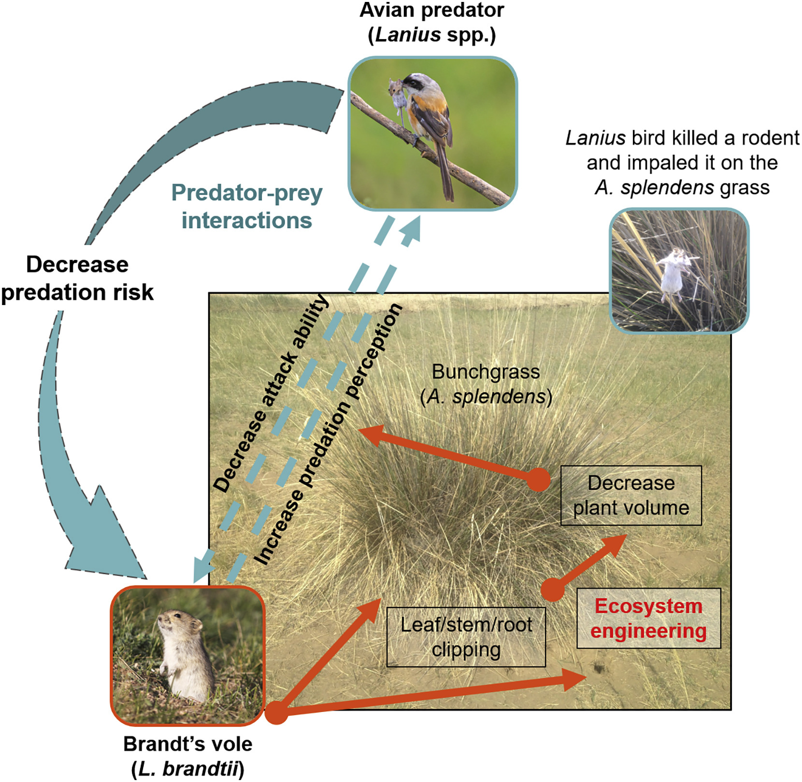

```{r setup, include=FALSE}
knitr::opts_chunk$set(echo = TRUE)
```
# A rodent herbivore reduces its predation risk through ecosystem engineering

## Background

The environment plays a role in predator-prey relationships. This paper studied Brandt’s voles which modify their habitat by cutting down bunchgrass (Achnatherum splendens) in the presence of shrikes. A. splendens is unpalatable and voles do eat it. Shrike perch on bunchgrasses to hunt voles and impale voles onto bunchgrass spikes for later.  By decreasing the volume of bunchgrass voles reduced visitations by shrikes and vole mortality rates drop. Their ecosystem engineering through damaging roots and clipping leaves can directly reduce their own predation risk by modifying habitat structure. 



```{r data}
library(dplyr)
library(tidyverse)
library(ggplot2)
library(ggpubr)
d <- read.csv("Ecosystem_engineers_and_predation_risk_data_-.csv")
head(d)
```
## Fig 2A
 
Inferential Statistic + Figure Replication


```{r Fig2A}
n <- d %>%
 group_by(Vole_Presence) %>%
  summarise_each(funs(mean,sd,se=sd(.)/sqrt(n())), Change_plantvol)
n  

g <- ggplot(n) +
  geom_col(aes(y=mean, x=Vole_Presence), fill="forestgreen") +
  geom_errorbar( aes(x=Vole_Presence,ymin=mean-se, ymax=mean+se), width=0.2, colour="black") +
ylab("Change in plant volume (m3)") + ylim(-1.5, 1.5)
g

```

They found that the average plant volume of A. splendens grass, given vole presence, was reduced by 0.63 m3, whereas the average plant volume of A. splendens in the absence of voles increased by 0.49 m3, as compared to the initial conditions (F1, 14 = 15.09; p = 0.0017; Figure 2A).

```{r 2A Inferential Statistics}
# One way anova of change in plant volume predicted by vole presence.
one.aov <- aov(as.numeric(Change_plantvol) ~ Vole_Presence, data = d)
summary(one.aov)

```
I found the same mean changes in plant volume but got a different F and P value through a one way anova. F 1,14 = 10.96 and P = 0.00257. I chose a one way anova because I wanted to see if the means of each group were the same. The authors didn't say what type of test was used

## Fig 2B
```{r Fig2B}
m <- d[ ,c(7,11)] 
m

ggplot(m, aes(x=as.numeric(Plant_cover), y=as.numeric(Birds_total15))) +
  geom_point(colour = "forestgreen", size = 5) + 
  geom_smooth(method = "lm", se=FALSE) +
  xlab("A. splendens cover %") + ylab("No. of visits by predatory birds/plot")

  
```

The total number of visits by predatory birds per plot was positively correlated with the coverage of A. splendens grass (pseudo-R2 = 0.252; z-ratio = 2.185; p = 0.029; Figure 2B).

```{r 2B Stats}
p <- d[1:15 ,7]
b <- d[1:15 ,11]

n <- lm(data = d, Birds_total15 ~ Plant_cover, na.omit=TRUE)
n

res <- cor.test(as.numeric(p), as.numeric(b), 
                    method = "pearson")
res


```
## Fig 4A

Descriptive Statistic


```{r 4A}


o <- d[1:18, c(18, 20, 21, 24)]
o <- data.frame(sapply(o, function(x) as.numeric(as.character(x))))
head(o)

a <- o %>% group_by(Plant_cover2) %>% 
  summarise_each(funs(mean,sd,se=sd(.)/sqrt(n())), 1:3) 
head (a)

g1 <- ggplot(a, aes(x=Plant_cover2, y=Bird_visit6_mean)) +
  geom_col(fill="blue") + 
  geom_errorbar( aes(x=Plant_cover2,ymin=Bird_visit6_mean-Bird_visit6_se, ymax=Bird_visit6_mean+Bird_visit6_se), width=0.2, colour="black") +
  xlab("A. splendens cover (%)") + ylab("No. of visits by predatory birds/plot") +
scale_x_continuous(breaks=c(0,50,100)) + ylim(0,4)
g1
```

## 4B

```{r 4B}
g2 <- ggplot(a, aes(x=Plant_cover2, y=Feeding_freq_mean)) +
  geom_col(fill="blue") +
  geom_errorbar( aes(x=Plant_cover2,ymin=Feeding_freq_mean-Feeding_freq_se, ymax=Feeding_freq_mean+Feeding_freq_se), width=0.2, colour="black") +
  xlab("A. splendens cover (%)") + ylab("Feeding frequency (%)") +
  scale_x_continuous(breaks=c(0,50,100)) + scale_y_continuous(breaks=c(0, 20, 40, 60, 80, 100)) + ylim(0,100)
g2
```

## 4C
```{r 4C}
g3 <- ggplot(a, aes(x=Plant_cover2, y=Vole_mortality_mean)) +
  geom_col(fill="blue") +
  geom_errorbar( aes(x=Plant_cover2,ymin=Vole_mortality_mean-Vole_mortality_se, ymax=Vole_mortality_mean+Vole_mortality_se), width=0.2, colour="black") +
xlab("A. splendens cover (%)") + ylab("Mortality rate (%)") + 
  scale_x_continuous(breaks=c(0,50,100)) + ylim(0,100)
g3

```
